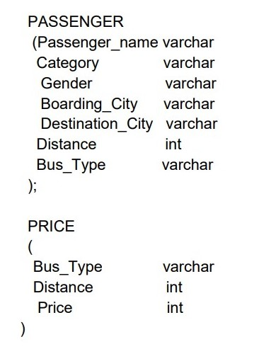
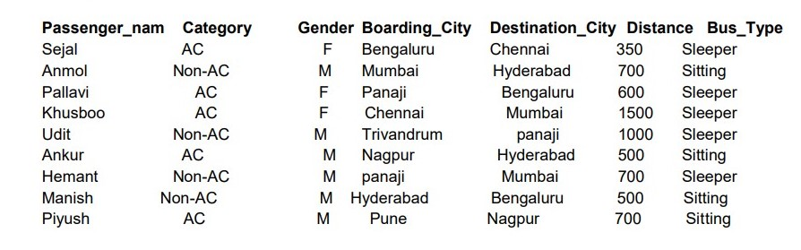
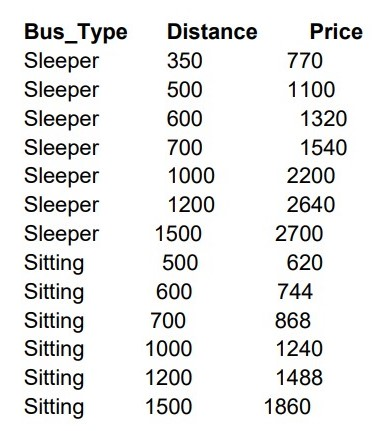
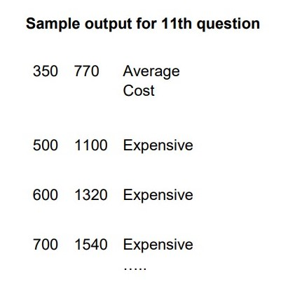

# PratviShah_DBMS-AssignmentSolution
## Problem Statement →

A travel company TravelOnTheGo maintains the record of passengers and price to travel between two cities, for bus types (Sitting and Sleeper).
1) You are required to create two tables PASSENGER and PRICE with the following attributes and properties.

\

2) Insert the following data in the tables.

> Write queries for the following:

3) How many females and how many male passengers travelled for a minimum distance of 600 KM s?
4) Find the minimum ticket price for Sleeper Bus. 
5) Select passenger names whose names start with character 'S' 
6) Calculate price charged for each passenger displaying Passenger name, Boarding City, Destination City, Bus_Type, Price in the output
7) What are the passenger name/s and his/her ticket price who travelled in the Sitting bus for a distance of 1000 KM s 
8) What will be the Sitting and Sleeper bus charge for Pallavi to travel from Bangalore to Panaji?
9) List the distances from the "Passenger" table which are unique (non-repeated distances) in descending order.
10) Display the passenger name and percentage of distance travelled by that passenger from the total distance travelled by all passengers without using user variables 
11) Display the distance, price in three categories in table Price\
a) Expensive if the cost is more than 1000\
b) Average Cost if the cost is less than 1000 and greater than 500\
c) Cheap otherwise\

